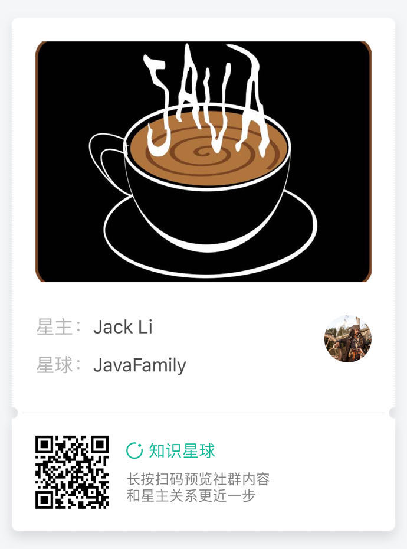

# JavaFamily
> 专注于 Java 及其相关领域研究及探索, 本站点为 JavaFamily 内部衍生而出的一系类组件、类库的梳理与统一. 详情可参看 [JavaFamily GitHub 主页](https://github.com/JavaFamilyClub)

## 目录
* 通知管理器 [notification-manager](https://github.com/JavaFamilyClub/notification-manager)

## Donate
> Please consider donating if you think docsify is helpful to you 
> or that my work is valuable. 
> I am happy if you can help me buy a cup of coffee. :heart:

## 社区
> 用户和开发团队通常在 [Gitter聊天室](https://gitter.im/javafamilychat/JavaFamilyLibrary)中。

## 关于我们
> JavaFamily 是一个专注于 Java 进阶的技术团队, 涵盖了目前大部分主流技术的实战与剖析, 
> 让您不仅知道 how, 而且知道 why? 长此以往, 我们最终是希望让每一个加入我们的朋友都具有
> 独自面对, 攻克底层原理与源代码的勇气和能力.
>
> 我们主要在微信公众号平台分享 Java 相关技术.

> 对于一些需要思考的内容, 我们会在知识星球发布作业

> 最后, 对于文字不好阐述或者比较难的技术我们会在哔哩哔哩以视频方式分享

> 专注分享, 只为更好的您!